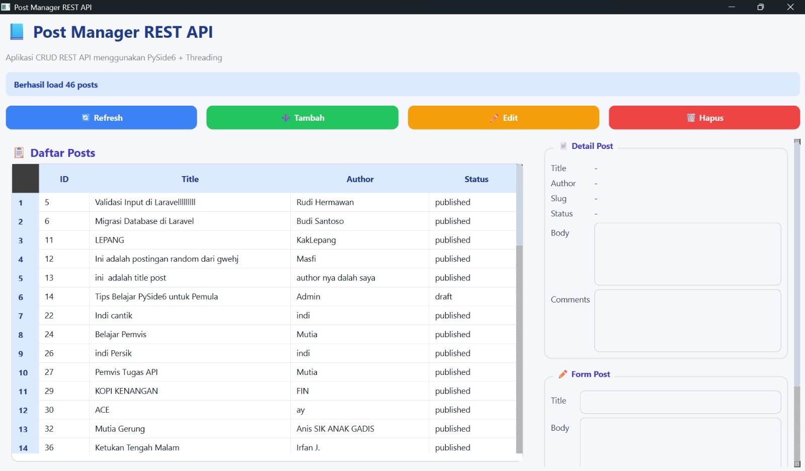
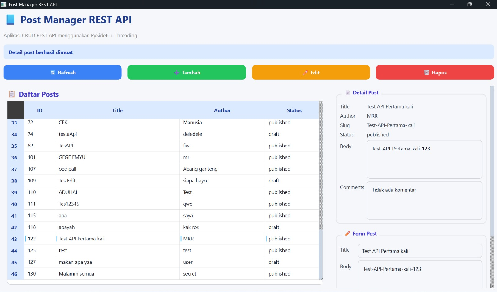
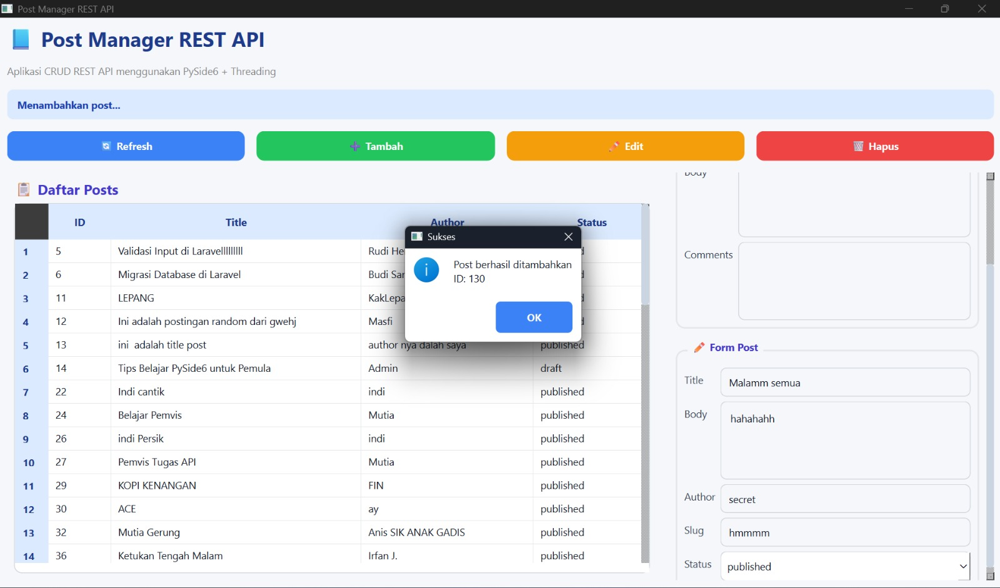
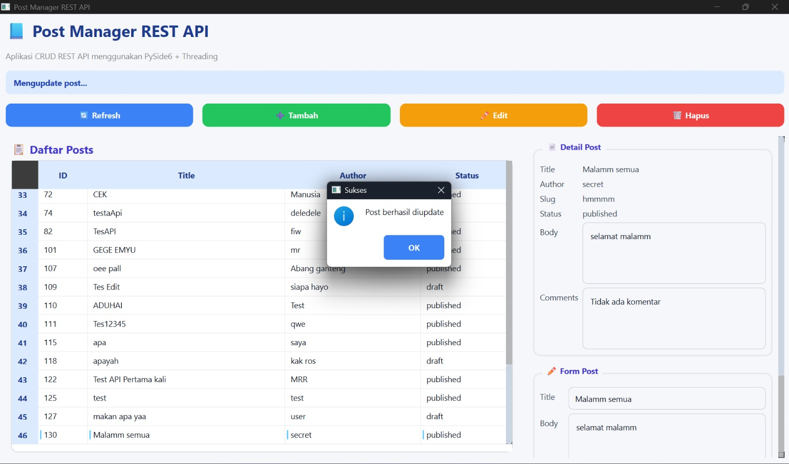
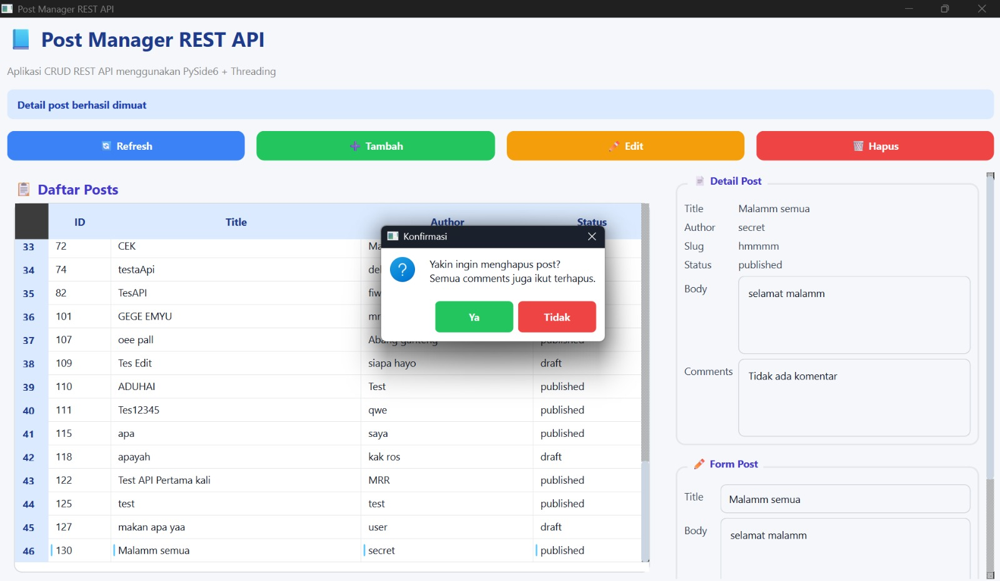
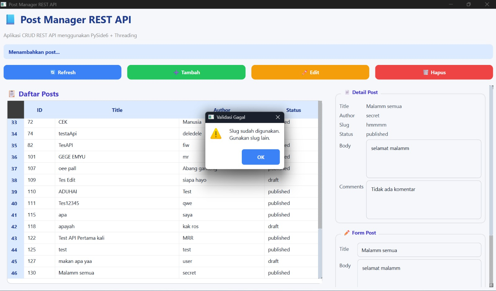

# T6-week11
## Deskripsi Program

Program ini merupakan aplikasi desktop **Post Manager** yang dibuat menggunakan bahasa pemrograman Python dengan framework **PySide6** untuk antarmuka (GUI). Aplikasi ini terhubung dengan layanan **REST API** pada endpoint: https://api.pahrul.my.id/api/posts

Aplikasi ini dibuat untuk mengelola data post secara lengkap menggunakan operasi CRUD (Create, Read, Update, Delete). Seluruh proses komunikasi dengan API dilakukan menggunakan library `requests` dan dijalankan pada thread terpisah menggunakan `QThreadPool` serta `QRunnable` agar tampilan aplikasi tetap responsif dan tidak mengalami freeze saat melakukan request data.Pada aplikasi ini, pengguna dapat melihat daftar seluruh post yang tersedia pada server, melihat detail post beserta komentar, menambahkan post baru, mengedit data post, dan menghapus post beserta komentar yang berkaitan (cascade delete).
Selain itu, aplikasi juga menerapkan error handling untuk menangani kondisi seperti:
- koneksi internet bermasalah
- timeout request
- validasi data dari server
- serta validasi slug unik dengan response error `422`

## Fitur yang Diimplementasikan

- GET semua post
- Detail post
- Tambah post
- Edit post
- Hapus post
- Multi-threading
- Error handling
- Validasi slug unik

## Screenshot

### Tampilan Utama

### Detail Post

### Tambah Post

### Edit Post

### Hapus Post

### Validasi Slug

